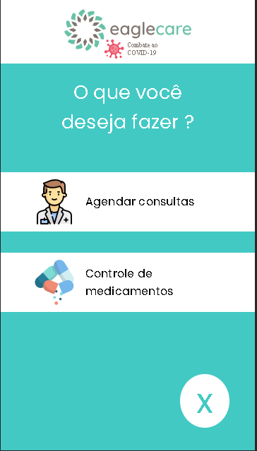

<h1 align="center">
    
</h1>

# Summary

- [Description](#📝-Description)
- [Project](#💻-Project)
- [Technologies](#🚀-Technologies)
- [Project Stats](#🎯-Project-Stats)

---

## 📝 Description

>💻 Eagle Care is a challenge app made for drugs and pills management related to Covid-19 virus.

---

## 💻 Project

* <b>Medical Appointment</b>: You can create personal register and medical management about you and other people's. After signed up is possible to control the drugs schedule and price.

* <b>Drugs Control</b>: Once the user was register is possible to control his daily medicine dosage and for how long he will be using. 

<h1 align="center">
    
</h1>

<h1 align="center">
    
</h1>

---

## 🚀 Technologies
This project was developed with the following technologies:
* VS Code;
* HTML;
* CSS;

---

## 🎯 Project Stats

This project is currently finished.

---

## :heavy_check_mark: To do list

- Save input data
- Add new option supplied by Medical Appointment and Drugs Control
- Add Social Features

---

## :handshake: Become a Contributor

Do you have any ideas that you want to implement it? It's simple!

1. Fork the project
2. Modify what you think is necessary
3. Commit the changes
4. Create a Pull Request

---

## Author

- Projects - [Lucass2021](https://github.com/Lucass2021)

- Linkedin - [@Lucas Dias da Silva](https://www.linkedin.com/in/lucas-dias-da-silva-118954199/)

- Email - [Lucas Dias](mailto:lucas.allx@hotmail.com")
